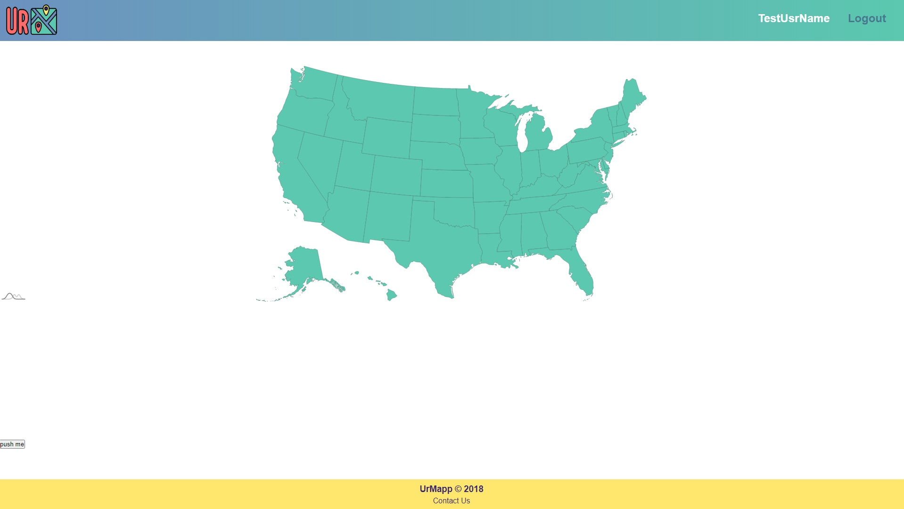

# UrMapp

Deployed Application: https://nameless-beach-59792.herokuapp.com/

GitHub Repository: https://github.com/Ericcrain77/urmapp

## Licensing

## Table of Contents
* [Description](#description)
* [Screenshots](#screenshots)
* [Technologies](#technologies)
* [Questions](#questions)

## Description
UrMapp is a react application that uses the Google Javascript Maps API to display a clickable map that allows you to show off all the states in the US that you've been to.

## Screenshots
Sign Up Page

Log In Page

HomePage

## Technologies

This application is written with React (as well as all of the dependencies found in the package.json files).

This application calls on the Google Maps Javascript API.

## Questions
Reach out to me using my [Github account](https://github.com/Ericcrain77) or my [email](ericcrain77@gmail.com).